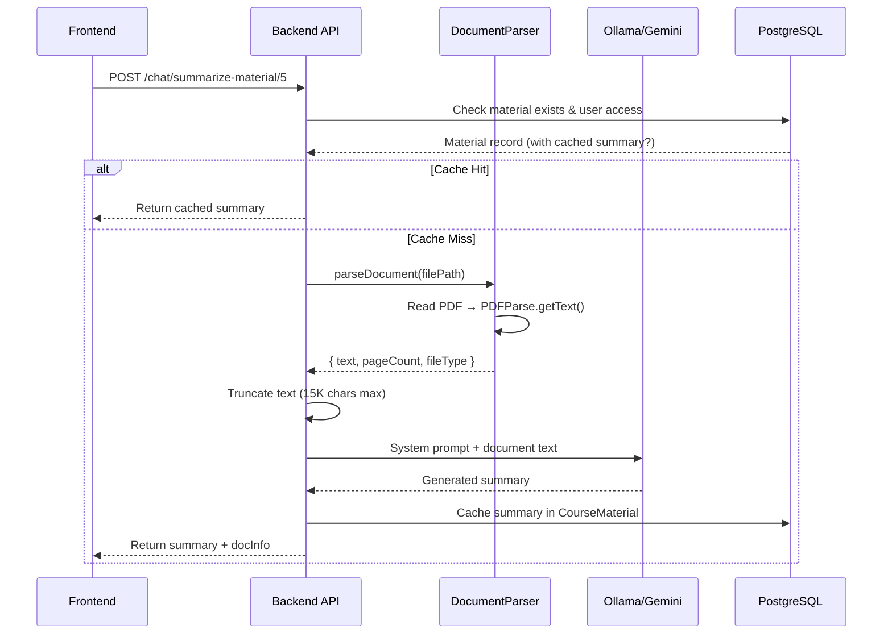

# PDF Parser Fix & AI Summarizer – Walkthrough & Frontend Integration Guide

## Changes Made

### 1. Fixed `pdf-parse` v2 API Migration

The core issue: `pdf-parse` was upgraded from **v1.x** to **v2.4.5** but the code still used the old v1 API.

#### [documentParser.ts](file:///workspace/src/utils/documentParser.ts)

**Before (broken – v1 API):**
```diff
- import pdfParse from 'pdf-parse';
- // ...
- const dataBuffer = await fs.readFile(filePath);
- const result = await pdfParse(dataBuffer);
- // result.text, result.numpages
```

**After (fixed – v2 API):**
```diff
+ import { PDFParse } from 'pdf-parse';
+ // ...
+ const dataBuffer = await fs.readFile(filePath);
+ const parser = new PDFParse({ data: dataBuffer });
+ const textResult = await parser.getText();
+ // textResult.text, textResult.total
+ await parser.destroy(); // cleanup
```

Key differences in v2:
- Named export `{ PDFParse }` instead of default export
- Class-based: `new PDFParse({ data })` → `.getText()` → `.destroy()`
- Text result uses `.total` for page count (not `.numpages`)
- Must call `.destroy()` to release resources (done in `finally` block)

#### [package.json](file:///workspace/package.json)

Removed `@types/pdf-parse` (v1 types) since `pdf-parse` v2.4.5 ships its own TypeScript declarations.

---

## Test Results

Tested against **2 PDF documents** from `uploads/courses/Materials/`:

| File | pdf-parse v2 | DocumentParser | AI Summarizer |
|------|:---:|:---:|:---:|
| Layered_architecture_revisited (4 pages, 20K chars) | ✅ | ✅ | ✅ (LLM) |
| Software_Engineering_Methodologies (8 pages, 26K chars) | ✅ | ✅ | ✅ (LLM) |

The Ollama server (`gemma3:1b` at `192.168.100.22:11434`) successfully generated academic summaries for both documents.

---

## Frontend Integration Guide

### API Endpoints

Your backend exposes these endpoints (all require JWT authentication):

#### 1. Material Summarization (AI Summary)

```
POST /api/chat/summarize-material/:materialId
```

> [!IMPORTANT]
> The `materialId` must be a valid `CourseMaterial` ID from the database. The user must be enrolled in the course (student) or teaching it (lecturer).

**Request:**
```http
POST /api/chat/summarize-material/5
Authorization: Bearer <JWT_TOKEN>
Content-Type: application/json

{
  "refresh": false
}
```

**Query params (alternative):**
- `?refresh=true` — force re-generate the summary (skips cache)

**Response (200 OK):**
```json
{
  "success": true,
  "data": {
    "material": {
      "id": 5,
      "title": "Software Engineering Methodologies",
      "description": "A review paper...",
      "fileUrl": "/uploads/courses/Materials/file.pdf",
      "course": "Rekayasa Perangkat Lunak"
    },
    "documentInfo": {
      "fileType": "pdf",
      "pageCount": 8,
      "textLength": 26553,
      "truncated": true
    },
    "summary": "**Summary:** This paper discusses two main software engineering...",
    "cached": false,
    "generatedAt": "2026-07-26T11:10:55.000Z"
  }
}
```

**Cached response** (subsequent requests return instantly):
```json
{
  "success": true,
  "data": {
    "material": { ... },
    "summary": "...",
    "cached": true,
    "generatedAt": "2026-07-26T11:10:55.000Z"
  }
}
```

#### 2. Chatbot Session Management

```
POST   /api/chat/sessions                         — Create session
GET    /api/chat/sessions                         — List sessions
GET    /api/chat/sessions/:sessionId/messages      — Get messages
POST   /api/chat/sessions/:sessionId/messages      — Send message
DELETE /api/chat/sessions/:sessionId               — Delete session
```

#### 3. Material CRUD

```
POST   /api/materials                — Create (admin/lecturer, with file upload)
GET    /api/materials/course/:courseId — List materials for a course
GET    /api/materials/:id            — Get single material
PUT    /api/materials/:id            — Update (admin/lecturer)
DELETE /api/materials/:id            — Soft delete (admin/lecturer)
```

---

### Frontend Implementation Example (React/Next.js)

#### API Service Layer

```typescript
// services/api.ts
const API_BASE = process.env.NEXT_PUBLIC_API_URL || 'http://localhost:8000/api';

async function fetchWithAuth(url: string, options: RequestInit = {}) {
  const token = localStorage.getItem('token'); // or from auth context
  const res = await fetch(`${API_BASE}${url}`, {
    ...options,
    headers: {
      'Content-Type': 'application/json',
      'Authorization': `Bearer ${token}`,
      ...options.headers,
    },
  });

  if (!res.ok) {
    const error = await res.json().catch(() => ({ message: res.statusText }));
    throw new Error(error.message || 'Request failed');
  }

  return res.json();
}

// ── Material Summarizer ──
export async function summarizeMaterial(materialId: number, refresh = false) {
  return fetchWithAuth(`/chat/summarize-material/${materialId}${refresh ? '?refresh=true' : ''}`, {
    method: 'POST',
  });
}

// ── Materials ──
export async function getMaterials(courseId: number) {
  return fetchWithAuth(`/materials/course/${courseId}`);
}

export async function getMaterial(materialId: number) {
  return fetchWithAuth(`/materials/${materialId}`);
}

// ── Chatbot ──
export async function createChatSession(topic: 'CUSTOMER_SERVICE' | 'SCHEDULING' | 'COURSE_SUMMARY') {
  return fetchWithAuth('/chat/sessions', {
    method: 'POST',
    body: JSON.stringify({ topic }),
  });
}

export async function getChatSessions() {
  return fetchWithAuth('/chat/sessions');
}

export async function sendChatMessage(sessionId: string, message: string) {
  return fetchWithAuth(`/chat/sessions/${sessionId}/messages`, {
    method: 'POST',
    body: JSON.stringify({ message }),
  });
}
```

#### Material Summary Component

```tsx
// components/MaterialSummary.tsx
import { useState } from 'react';
import { summarizeMaterial } from '@/services/api';

interface MaterialSummaryProps {
  materialId: number;
  materialTitle: string;
}

export function MaterialSummary({ materialId, materialTitle }: MaterialSummaryProps) {
  const [summary, setSummary] = useState<string | null>(null);
  const [loading, setLoading] = useState(false);
  const [error, setError] = useState<string | null>(null);
  const [docInfo, setDocInfo] = useState<any>(null);
  const [cached, setCached] = useState(false);

  const handleSummarize = async (refresh = false) => {
    setLoading(true);
    setError(null);
    try {
      const res = await summarizeMaterial(materialId, refresh);
      setSummary(res.data.summary);
      setDocInfo(res.data.documentInfo);
      setCached(res.data.cached);
    } catch (err: any) {
      setError(err.message);
    } finally {
      setLoading(false);
    }
  };

  return (
    <div className="material-summary">
      <h3>{materialTitle}</h3>
      
      <div className="actions">
        <button onClick={() => handleSummarize(false)} disabled={loading}>
          {loading ? '⏳ Generating Summary...' : '🤖 Summarize with AI'}
        </button>
        {summary && (
          <button onClick={() => handleSummarize(true)} disabled={loading}>
            🔄 Regenerate
          </button>
        )}
      </div>

      {error && <div className="error">❌ {error}</div>}

      {summary && (
        <div className="summary-result">
          {cached && <span className="badge">📦 Cached</span>}
          {docInfo && (
            <div className="doc-info">
              📄 {docInfo.fileType.toUpperCase()} • {docInfo.pageCount} pages • 
              {Math.round(docInfo.textLength / 1000)}K chars
              {docInfo.truncated && ' (truncated)'}
            </div>
          )}
          <div className="summary-content" 
               dangerouslySetInnerHTML={{ __html: markdownToHtml(summary) }} />
        </div>
      )}
    </div>
  );
}
```

#### Integration into Course Page

```tsx
// pages/course/[courseId].tsx
import { getMaterials } from '@/services/api';
import { MaterialSummary } from '@/components/MaterialSummary';

export default function CoursePage({ courseId }: { courseId: number }) {
  const [materials, setMaterials] = useState([]);

  useEffect(() => {
    getMaterials(courseId).then(res => setMaterials(res.data));
  }, [courseId]);

  return (
    <div>
      <h2>Course Materials</h2>
      {materials.map((mat: any) => (
        <div key={mat.id} className="material-card">
          <div className="material-header">
            <h3>{mat.title}</h3>
            {mat.fileUrl && (
              <a href={`${API_BASE}${mat.fileUrl}`} target="_blank">
                📥 Download
              </a>
            )}
          </div>
          {mat.description && <p>{mat.description}</p>}
          
          {/* AI Summarizer Button */}
          {mat.fileUrl && (
            <MaterialSummary 
              materialId={mat.id} 
              materialTitle={mat.title} 
            />
          )}
        </div>
      ))}
    </div>
  );
}
```

---

### Architecture Flow



### Configuration

Your `.env` controls which LLM provider is used:

```env
# Options: "ollama" | "gemini" | "openai"
CHATBOT_PROVIDER="ollama"
CHATBOT_API_URL="http://192.168.100.22:11434"
CHATBOT_MODEL="gemma3:1b"
CHATBOT_API_KEY=""
```

> [!TIP]
> For production, consider using `gemini` with `CHATBOT_PROVIDER="gemini"` and a valid `CHATBOT_API_KEY`. The Gemini API is faster and doesn't require running your own model server.

### Supported Document Types

The `DocumentParser` handles:
- **PDF** (`.pdf`) — via `pdf-parse` v2
- **Word** (`.docx`) — via `mammoth`
- **PowerPoint** (`.pptx`) — via `JSZip` (extracts `<a:t>` text runs)
- **Text** (`.txt`, `.md`) — direct file read
